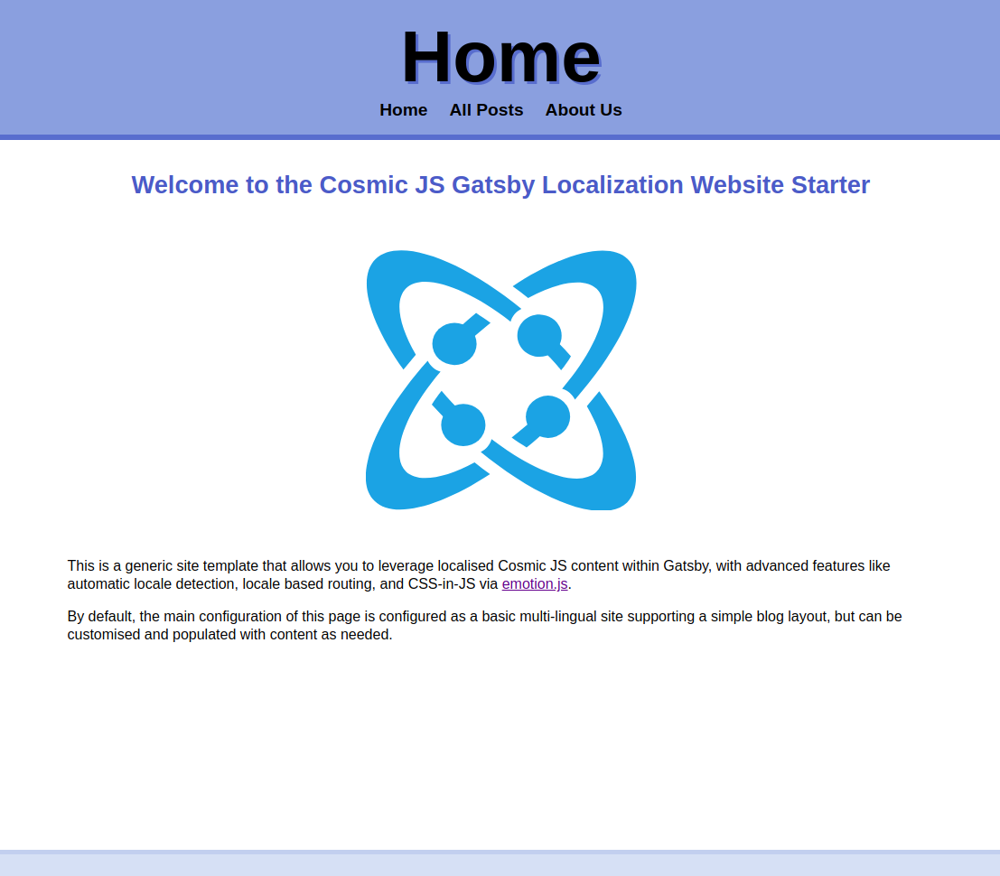
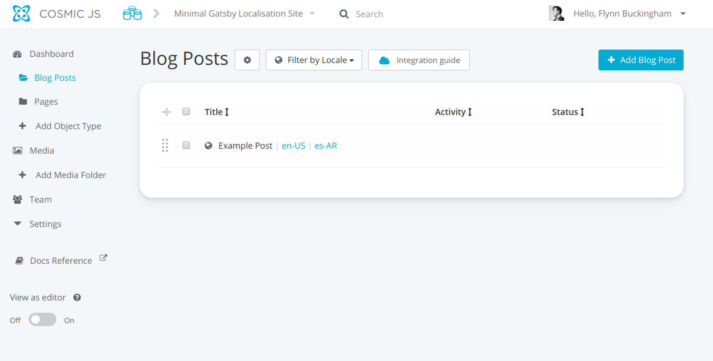
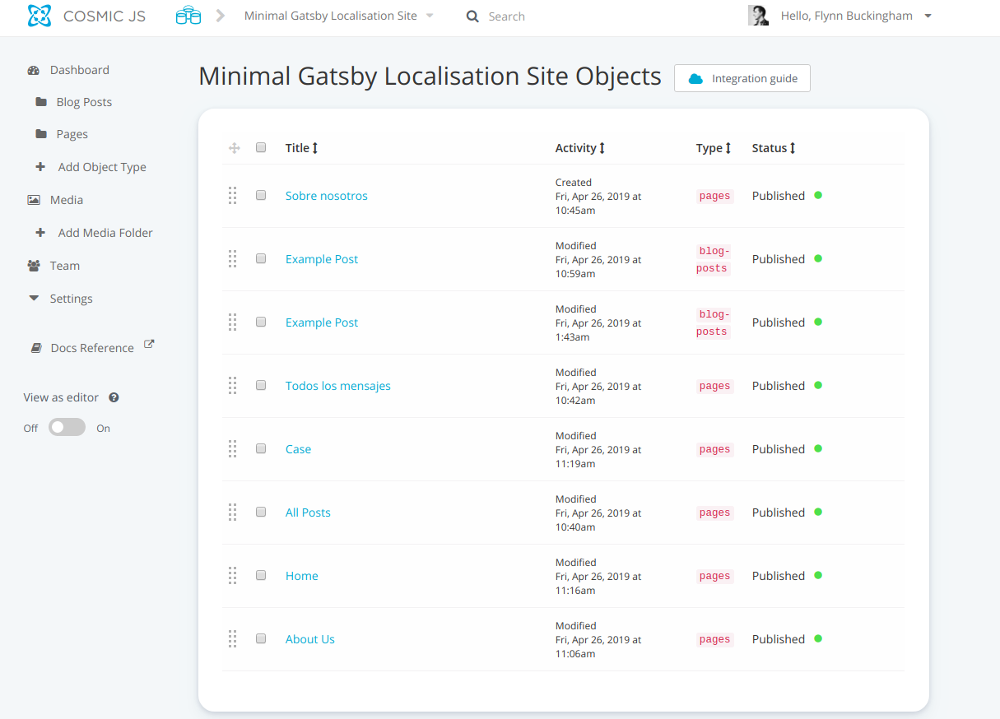
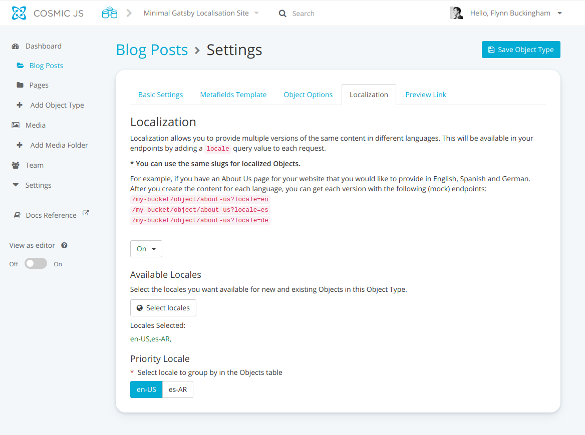

## Preface

It's been quite a while since I last created a demo application for Cosmic JS, and it's been refreshing to see how much the platform has grown over the last year as it's taken on new endeavors and has solved new business challenges in the process. One of the improvements that's been added overtime are the substantial amount of new plugins and integrations, along with some nice hidden improvements to how Cosmic JS handles and manages localised content.

## Before We Start

Cosmic JS is a CMS platform that lets you leverage your content in a way that's agnostic to any specific platform. Essentially, it decouples you from having to lock your content down to a single framework, enabling you to implement and extend your own content as you wish. One of the most recent additions to the Cosmic JS toolbelt is the [`gatsby-source-cosmicjs`](https://github.com/cosmicjs/gatsby-source-cosmicjs) plugin for Gatsby JS, allowing you to embed your Cosmic JS content into a statically generated React application.

I'll be honest, I', typically rather old-fashioned when it comes to storing static content. As someone with a background of storing content within JSON files and rendering it with Pug/Jade, it's always refreshing to see how far content management strategies have come over the last decade. Gatsby is basically the effective way to leverage static hosting (for that sweet SEO gain), but still allowing you to leverage the abilities of a dynamic React environment.

As a means of helping people like me who are into the essentials, and then building up from that, I've created a minimalistic Cosmic JS + Gatsby localisation starter application.

## What is localisation anyways?

Localisation is the act of making your content accessible to individuals outside of the language boundary you are typically used to, or simply put, the act of making websites comprehensive for people who don't speak the same language. Website localisation is also a form of web accessibility, in the sense that by implementing it you are enabling a larger section of your preferred demographic to digest your content, which is great for everyone, including your add revenue, or just overall site traffic.

## Installing the demo (from Cosmic JS App Section)

Cosmic JS provides an easy-to-use means of creating your own clone of this starter application from their own web ui. If you don't like getting your hands too dirty, or just would like to give the starter app a test drive, you can access it from here. The prompts will guide you in creating an account and creating the necessary items.

## Installing the demo (from source)

The project source can be found `here` on github. After cloning the repository, you should have something that loosely resembles the following structure.

```
.gitignore
config.js
gatsby-config.js
gatsby-node.js
package.json
package-lock.json
LICENSE
src
├── components
│   ├── atoms
│   │   ├── HeaderNav.js
│   │   ├── HTMLContentArea.js
│   │   ├── LocaleSelector.js
│   │   └── PostTile.js
│   ├── layouts
│   │   ├── Blog.js
│   │   ├── common
│   │   │   ├── Container.js
│   │   │   ├── GlobalStyles.js
│   │   │   └── Head.js
│   │   └── Default.js
│   ├── modules
│   │   ├── BlogPost.js
│   │   ├── SitePage.js
│   │   ├── SitePostListing.js
│   │   └── withLocale.js
│   └── molecules
│       ├── Footer.js
│       ├── Header.js
│       └── PostList.js
└── pages
    └── index.js
```

Also make sure you `npm install` so you have the needed repositories for running the Gatsby starter application.

### Configuring the base project

The project itself has two main files that are intended to be configure. `gatsby-config.js` is responsible for specifying which Cosmic JS Bucket to source your content from, while the `config.js` file is used for configuring various front-end portions of your application.

To ensure that Gatsby is able to read your Cosmic Js Bucket, you need to fill out the areas within `gatsby-config.js` that resemble the following:


```js
module.exports = {
	plugins: [
		'gatsby-plugin-emotion',
		'gatsby-plugin-react-helmet',
		{
			resolve: `gatsby-source-cosmicjs`,
			options: {
				bucketSlug: 'minimal-gatsby-localisation-site',
				objectTypes: ['blog-posts', 'pages'],
				apiAccess: {
					read_key: ``,
				}
			}
		}
	],
}
```

For the above, ensure that the `bucketSlug` values correlates with your own Cosmic JS Bucket, and that the `apiAccess.read_key` is present if you've configured your bucket to require it. Also make sure you have `blog post` and `pages` Nodes within your Bucket, otherwise the `gatsby-source-cosmicjs` will not have the correct Gatsby GraphQL queries (preventing you from running the demo)

## Running the demo

To start the demo (in development mode) after all dependencies have been started, simply run `npm start`, or alternatively `npm run develop`. The project will then (by default) be accessible on port `8000` on `localhost`. The console output of the command will also let you know in case its been configured otherwise.

The first thing you see should resemble.




## How it works

This localisation starter app in particular relies heavily on the `locale` value that's bound to each Cosmic JS Object. While each Object would normally require each item to have a unique `slug` constraint (meaning that slug would need to be unique among all other nodes of a given type): because we'd have localisation enabled for this particular projection, we no longer need to worry about that. With localisation, a Object can have have the same `slug` value given that each variant also has a unique `;pca;e` specified.

The `withLocale` component from `src/components/modules/withLocale.js` contains login that's responsible that a connected Gatsby page, can resolve which locale a given Page or Blog Post should be shown with, and any alternative links based on a resources available locale variations. So for example, if a blog post with a slug of `example-post` has locale variants in `en-US` and `es-AR`, the correct page to show will be determined by:

* The `locale` specified in the Gatsby `pageContext` value (if present)
* The `locale` detected from the url
* The first available `locale` value of the resource being presented

Each of these values are compared against the value of `window.navigator.languages` and the value of `fallbackLocale` within `config.js`. This is helpful in situations where the content type being requested isn't actually available for a specific Page or Blog Post, or when the page has no contextually available `locale`, such in the case of `src/pages.index`, which will redirect to the most preferable locale based on browser config.

`withLocale` is also responsible for resolving a value called `alternateResourceUrls`, which is a key-value mapping of alternate locales of the currently shown page. This is used by components such as the `src/components/atoms/LocaleSelector`.


## Project structure

The overall design structure of this application is minimal, loosely following the Atomic Design principles, in the sense that:

* `src/components/atoms` contains components that don't solely depend on other complex child components
* `src/components/layouts` contains components responsible for grouping various components together
* `src/components/modules` contains components responsible for representing connected (dynamic values)
* `src/components/molecules` contains components that are abstract configurations of `atoms`

`src/pages` is responsible for storing static Gatsby pages that are usually mapped 1-1 like normal html pages. As such, files named `index` are treated as directory files, and files named anything represent a static path relative to the root.

### Why does this starter project not have any static query pages?

As a localised starter application, the content being rendered is inherently dynamic, since it's not capable of being mapped easily within a static application without requiring path subsets. Adding a static React page (i.e. `localhost:8000/pictures-of-cats`) would be the equivalent of making a `default export` React component in `src/pages/pictures-of-cats.js`.

### Where are the css files?

This starter application leverages a CSS-in-JS technology called `emotionjs`, which removes the requirement of serving static css bound to `className` attributes, since the styles themselves are bound when they are mounted. In SSR this is beneficial since it's deterministic nature allows more predictable style hydration and preloading.

#### Creating an styled component or usable css class

Emotion provides _two*_ main ways of generating reusable styles for components.

One is via `@motion/styled`, which enables you to generate elements with bound `className` attributes.

```js
import React from 'react';
import styled from '@emotion/styled';

// direct format
const yourCoolStyledComponent = styled.div`
	color: red;
`;

// component wrapping format
const SomeActualComponent = ({ className }) =>
	<div className={className} />;

const yourCoolAlternateStyledComponent = styled(SomeActualComponent)`
	color: blue;
`;
```

The second form is via the `{ css }` helper from `@emotion/core`. It allows you to generate deterministic (and reusable) classnames;

```js
import React from 'react';
import { css } from '@emotion/core';

const customCssClassName = css`
	color: green;
`;

const CoolDiv = () => (
	<div className={customCssClassName} />
);
```

There are more advanced examples of how to do this from the emotionjs documentation [here].

## Managing content

In order for this starter application to work, a few assertions must be made.

1. You should already have `Pages` and `Blog Posts` Objects configured for your bucket
2. Each Object needs to have localisation enabled
3. Each `Page` and `Blog Post` should have the same `locales` available and should have each
locale variant present.

So your environment should look something like this:




### Enabling localisation for Cosmic Object Types

On left left hand sidebar under `Dashboard` after creating each respective Object Type you should have `Blog Posts` and `Pages` as small folder icons visible under the dashboard. From that same interface, you should also see a small `cog` near the top of the listing. CLicking that will bring up an interface to enable localisation.



Toggle `Localisation` to `On` and then, add the locales you'd like to support for your application. These should be same same for both

## Conclusion

Cosmic JS is an incredibly powerful means of allowing your content to be made available to various locations across the web, and it's localisation toolset lets to leverage this in a way where many people can benefit and appreciate your business or personal content, regardless of international barriers. Looking forward to see where the community will be able to take Cosmic JS to in the future.
